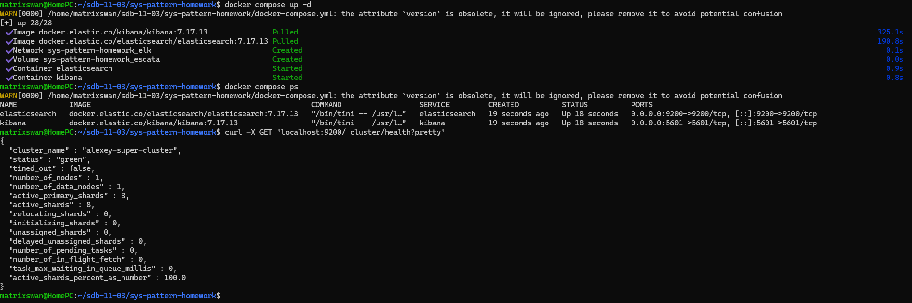
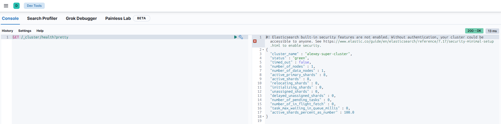
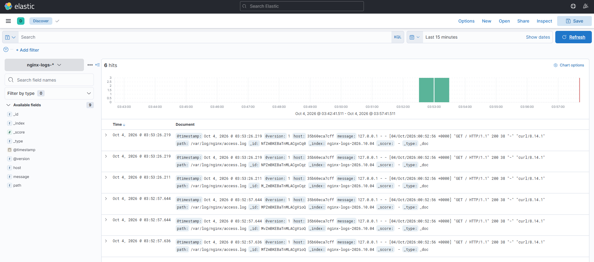
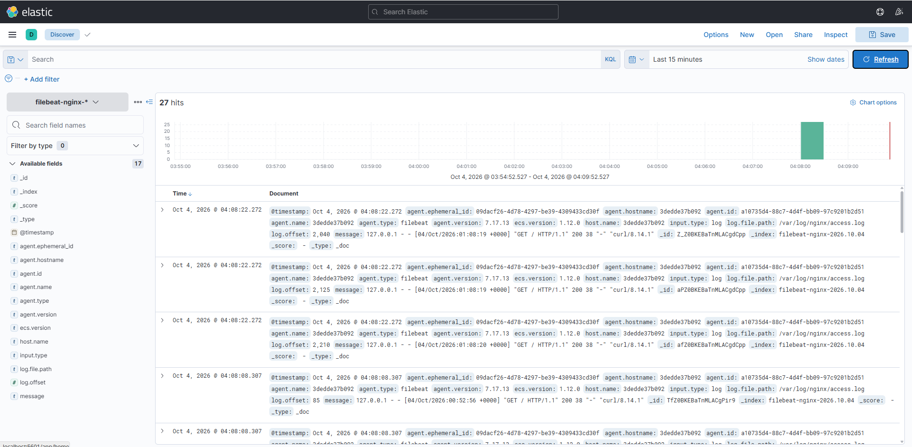

# Домашнее задание к занятию «ELK» - Сидоренко Алексей

---

### Задание 1. Elasticsearch 

Установите и запустите Elasticsearch, после чего поменяйте параметр cluster_name на случайный. 

**Этапы выполнения:**
1. Создан файл `docker-compose.yml` с образом `elasticsearch:7.17.13`.
2. В параметрах среды (environment) задан параметр `cluster.name=alexey-super-cluster`.
3. Стек запущен командой `docker compose up -d`.
4. Проверка выполнена через curl: `curl -X GET 'localhost:9200/_cluster/health?pretty'`

**Скриншот:**

---

### Задание 2. Kibana

Установите и запустите Kibana.

**Этапы выполнения:**
1. Kibana запущен в том же `docker-compose.yml` (образ `kibana:7.17.13`).
2. Интерфейс доступен по адресу `http://localhost:5601`.
3. В разделе Dev Tools выполнен запрос `GET /_cluster/health?pretty`.

**Скриншот:**

---

### Задание 3. Logstash

Установите и запустите Logstash и Nginx. С помощью Logstash отправьте access-лог Nginx в Elasticsearch. 

**Этапы выполнения:**
1. В `docker-compose.yml` добавлены сервисы `nginx` и `logstash`.
2. Для Nginx создан кастомный `nginx.conf`, направляющий логи в файл `/var/log/nginx/access.log`.
3. Для Logstash создан `logstash.conf`, который читает этот файл (input file) и отправляет в Elasticsearch (output elasticsearch) с индексом `nginx-logs-*`.
4. В Kibana создан Index Pattern `nginx-logs-*` и логи проверены в разделе Discover.

**Скриншот:**

---

### Задание 4. Filebeat. 

Установите и запустите Filebeat. Переключите поставку логов Nginx с Logstash на Filebeat. 

**Этапы выполнения:**
1. В `docker-compose.yml` добавлен сервис `filebeat` (образ `filebeat:7.17.13`).
2. Создан файл `filebeat.yml`, настроенный на чтение `/var/log/nginx/access.log` и прямую отправку в Elasticsearch с индексом `filebeat-nginx-*`.
3. В Kibana создан Index Pattern `filebeat-nginx-*` и логи проверены в разделе Discover.

**Скриншот:**

